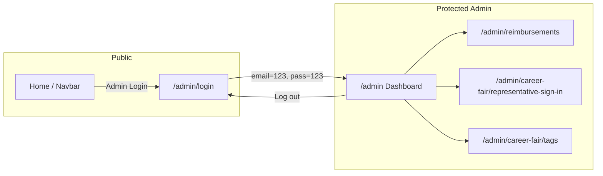

# Admin Dashboard — End-to-End Plan

## Scope

- **Frontend only**: Hardcoded credentials, placeholder submissions, mock chart data. No backend or real auth.
- **Adherence**: Follow [ui-core-migration.md](file:///Users/visheshanand/Developer/src/github/AnandVishesh1301/tribunal/.cursor/plans/ui-core-migration.md): shadcn components, Framer Motion, brand tokens (#E00122, etc.), `max-w-6xl` containers, Navbar + main + Footer, lucide-react only, TypeScript, semantic HTML.

---

## 1. Auth Flow (Frontend-Only)

- **Login entry**: Add an "Admin Login" (or "Login") link at the **end** of the navbar — after the existing nav links, before "Get Involved" on desktop; include it in the mobile sheet as well. Use `Link` to `/admin/login` and a lucide icon (e.g. `LogIn`).
- **Login page** (`/admin/login`):
  - Same shell: `<Navbar />`, `<main className="min-h-screen bg-white">`, `<Footer />`.
  - Centered card (shadcn `Card`) with:
    - Email input, password input, submit button.
    - Client-side check: if email === `"123"` and password === `"123"`, set "logged in" and redirect to `/admin`. Otherwise show inline error.
  - **Session**: Store auth state in `localStorage` (e.g. `adminAuthenticated: "true"`) so refresh keeps the user logged in. No JWT/tokens.
- **Protected routes**: Create a small `AdminGuard` (or wrapper) that reads auth from `localStorage`; if not authenticated, redirect to `/admin/login`. Use for all `/admin/`* routes except `/admin/login`.
- **Logout**: On the admin dashboard (and optionally in navbar when on admin routes), provide a "Log out" control that clears `localStorage` and redirects to `/admin/login`.

---

## 2. Routing

Add to [src/routes/index.tsx](Phoenix/src/routes/index.tsx):

- `GET /admin/login` → Admin login page (no guard).
- `GET /admin` → Admin dashboard (protected).
- `GET /admin/reimbursements` → Reimbursements form page (protected).
- `GET /admin/career-fair/representative-sign-in` → Representative sign-in page (protected).
- `GET /admin/career-fair/tags` → Tags printing page (protected).

Lazy-load admin pages. Wrap protected routes with `AdminGuard` so unauthenticated users are redirected to `/admin/login`.

---

## 3. Admin Layout and Dashboard Page

- **Layout**: Reuse existing layout pattern: `<Navbar />`, `<main className="min-h-screen bg-white">` with `max-w-6xl mx-auto px-4 sm:px-6 lg:px-8`, `<Footer />`. No separate admin shell; keep the same site chrome so the admin area feels consistent.
- **Dashboard** (`/admin`):
  - **Above the fold**: Short heading (e.g. "Admin Dashboard") and optional subtitle. Then a grid of **cards** (shadcn `Card`) linking to:
    1. **Our Reimbursements** → `/admin/reimbursements`
    2. **Career Fair Representative Sign-In** → `/admin/career-fair/representative-sign-in`
    3. **Career Fair Tags Printing** → `/admin/career-fair/tags`
  - Each card: title, short description, icon (lucide), and link (e.g. "Open" or "Go to page"). Use Framer Motion for stagger/fade-in.
  - **Below**: A "Metrics" or "Engagement" section with **2–3 charts** (see section 6). Keep it minimal and clean.
  - **Log out**: Button or link in the dashboard header or top-right to log out (clear storage, redirect to `/admin/login`).

---

## 4. Reimbursements Page

- **Source**: [Legacy reimbursement form](https://tribunal.uc.edu/reimbursement/) — keep only existing fields; rebuild with shadcn.
- **Fields to implement** (from legacy):
  - **Member Information**: Vendor ID (text input). Include a short helper link/note: "Don't know your Vendor ID? [View vendor ID list]" (placeholder URL or `#`).
  - **Expenditure Information**:
    - "Was this a budgeted expense?" → **Yes / No** (shadcn `RadioGroup` or two radios).
    - "How would you like to be reimbursed?" → **Direct Deposit** / **Check** (same).
  - **Supporting documents**:
    - "Scanned Itemized Receipt" (required) — file upload (single file). Helper text: receipt must be itemized.
    - "Supporting Reimbursement Documents" (optional) — file upload. Helper text: e.g. attendance sheet, email proof; multiple docs can be one PDF.
- **UI**: Single column form inside a `Card`, sections for "Member Information", "Expenditure Information", "Supporting Documents". Use shadcn `Input`, `Label`, `RadioGroup` (or add), and a file input (native `<input type="file">` styled with Tailwind to match, or a simple drag-drop zone using existing components). Primary submit button: "Submit request". On submit: frontend-only placeholder (e.g. `alert("Request submitted")` or a toast if you add a toast component later).
- **Copy**: Reuse legacy intro text (reimbursement within 2 weeks, treasurer email placeholder).

---

## 5. Career Fair Representative Sign-In Page

- **Source**: [Legacy representative sign-in](https://tribunal.uc.edu/careerweek/representative-sign-in/representative.html) — "Where are you located?" then success message.
- **UI**: One question: "Where are you located?" with a **dropdown** (shadcn `Select`) of placeholder locations (e.g. "Booth A1", "Booth A2", "Main Hall", "Virtual"). Submit button: "Sign in". On submit: show success state on the same page — "You have successfully signed in" and a button/link "Sign in another representative" that resets the form. No backend; state only.

---

## 6. Career Fair Tags Printing Page

- **Source**: [Legacy admin representative / printing](https://tribunal.uc.edu/careerweek/representative-sign-in/admin/representative.html) — printer selection, location filter, table of representatives.
- **UI**:
  - **Printer**: "Select a connected DYMO printer" — shadcn `Select` with placeholder options (e.g. "DYMO LabelWriter 450", "No printer detected") for frontend demo.
  - **Location**: "Select Location" — `Select` with same (or similar) placeholder locations as the representative sign-in page.
  - **Table**: Columns — **Name**, **Company**, **Title**, **Booth Location**, **Time Added**. Use a semantic `<table>` with Tailwind styling (or add shadcn `Table` if desired). Populate with **placeholder rows** (3–5 fake representatives) so the layout is clear.
  - Optional: "Print" or "Print tags" button that does nothing (or `window.print()` for demo). Keep the page minimal and readable.

---

## 7. Metrics Visualizations (Dashboard)

- **Goal**: A few critical charts for event attendance / engagement and general body meetings, without overdoing it.
- **Suggested charts** (2–3 total, placeholder data):
  1. **Event attendance (e.g. last 3–6 events)** — **Bar chart**: event name (or month) vs. attendance count. Good for comparing events at a glance.
  2. **General body meeting trend** — **Line or area chart**: meeting date (or month) vs. attendance. Shows trend over time.
  3. **Optional**: One more metric (e.g. total engagement by category, or a simple KPI card) if it fits the "critical only" ask.
- **Implementation**:
  - Use **shadcn charts** built on Recharts: add the [chart component](https://ui.shadcn.com/charts) (e.g. `npx shadcn@latest add chart`) and install **recharts** as per shadcn docs.
  - Use **Bar** and **Line** (or **Area**) from Recharts inside `ChartContainer` with `ChartTooltipContent` for accessibility and consistency.
  - Define **mock data** (e.g. `ATTENDANCE_BY_EVENT`, `GBM_ATTENDANCE_TREND`) in the dashboard or a small `adminChartData` module. Use brand-compatible colors (e.g. primary #E00122 in chart config).
- **Placement**: In a "Metrics" or "Engagement" section below the three dashboard cards. Each chart in a card with a short title.

---

## 8. New Shadcn / Dependencies

- **Components to add** (via shadcn CLI where possible):
  - **input** — forms (login, reimbursement, any text fields).
  - **label** — all form fields.
  - **select** — reimbursement method, location, printer, etc.
  - **radio-group** — budgeted yes/no, reimbursement method (or use two custom radios with shadcn styling).
  - **chart** — for dashboard metrics (requires **recharts**; add when adding chart).
- **New dependency**: **recharts** (required for shadcn chart). No other new packages unless you confirm.

---

## 9. File and Structure Summary

| Item        | Path / action                                                                                                                                                                           |
| ----------- | --------------------------------------------------------------------------------------------------------------------------------------------------------------------------------------- |
| Navbar      | Add "Admin Login" link (and conditional "Log out" when authenticated on admin).                                                                                                         |
| Routes      | Add `/admin/login`, `/admin`, `/admin/reimbursements`, `/admin/career-fair/representative-sign-in`, `/admin/career-fair/tags`; protect admin routes with guard.                         |
| Admin guard | New: `src/components/AdminGuard.tsx` (or `src/guards/AdminGuard.tsx`) reading `localStorage`, redirect to `/admin/login` if not set.                                                    |
| Pages       | New: `AdminLoginPage`, `AdminDashboardPage`, `AdminReimbursementsPage`, `AdminRepresentativeSignInPage`, `AdminTagsPrintingPage` under `src/pages/` (e.g. `admin/` subfolder optional). |
| Chart data  | Mock data in dashboard file or `src/data/adminChartData.ts`.                                                                                                                            |
| UI          | Add shadcn: input, label, select, radio-group, chart; install recharts.                                                                                                                 |

---

## 10. Flow Diagram

---

## 11. Order of Implementation

1. Add shadcn **input**, **label**, **select**, **radio-group**; add **chart** + **recharts**.
2. **AdminGuard** and **AdminLoginPage**; add "Admin Login" to Navbar; wire routes for `/admin/login` and `/admin`.
3. **AdminDashboardPage**: cards to the three pages + Metrics section with 2–3 charts (mock data).
4. **AdminReimbursementsPage** with all legacy fields and placeholder submit.
5. **AdminRepresentativeSignInPage** (location select + success state).
6. **AdminTagsPrintingPage** (printer, location, table with placeholder rows).
7. Log out behavior and any navbar tweaks (e.g. show "Log out" when on admin and authenticated).

This keeps the admin section minimal, modern, and consistent with the rest of the site while staying frontend-only and ready for future backend and signup.